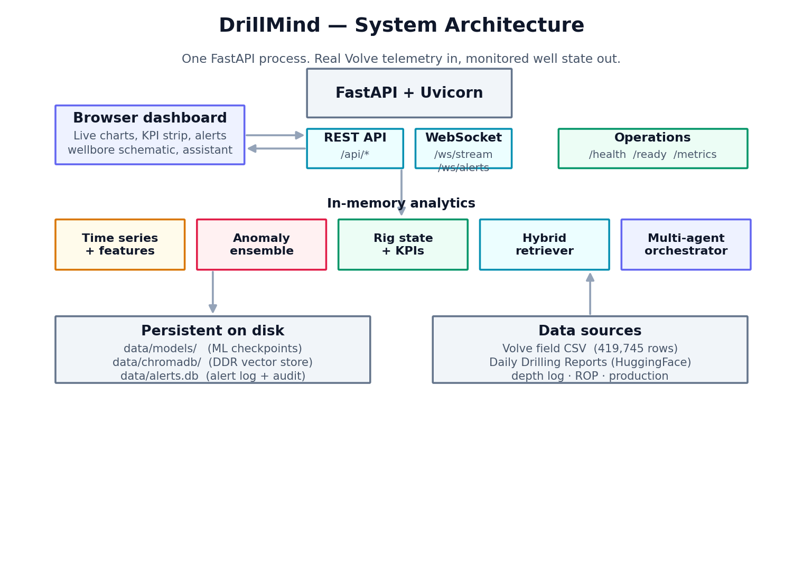
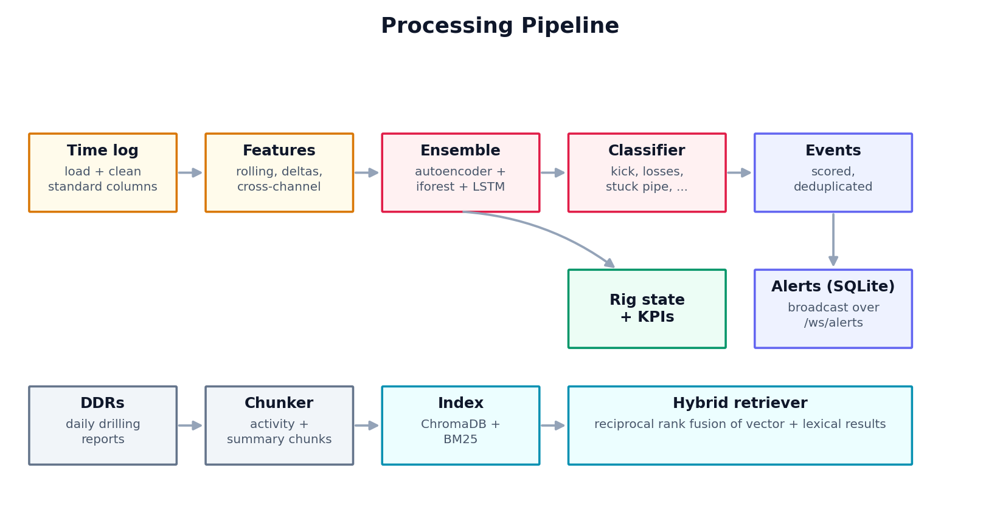
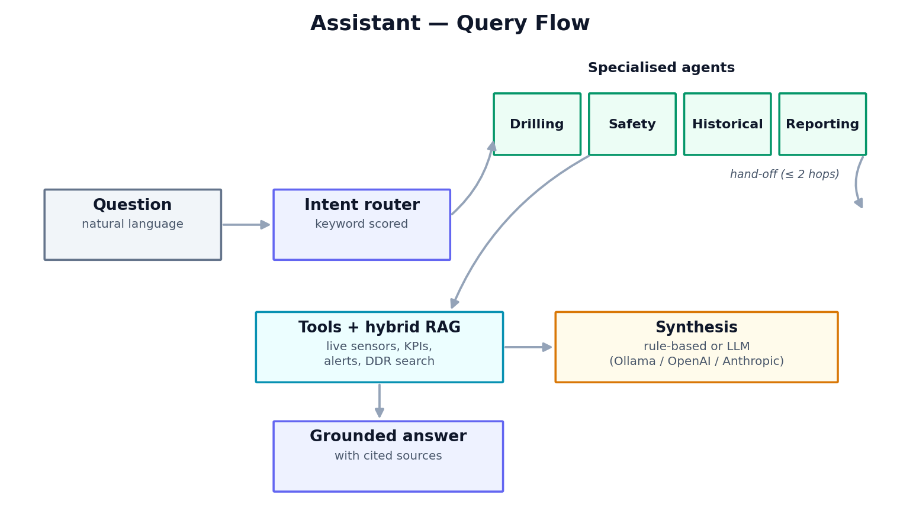

# DrillMind

**Real-time drilling analytics on the Equinor Volve open dataset.**


DrillMind monitors live drilling telemetry, flags abnormal behaviour before it turns into an incident, classifies what the rig is doing, keeps a persistent alert log, and answers plain-English questions about the well — all grounded in real sensor data and daily drilling reports from the Volve field on the Norwegian Continental Shelf.

It is built entirely on the [Equinor Volve open dataset](https://www.equinor.com/energy/volve-data-sharing): 419,745 rows of real sensor data from well 15/9-F-9 A. There is no synthetic data and no mock services — every column name is verified against the actual CSV files.

Everything runs in a single process: FastAPI for the REST API and WebSockets, a small machine-learning stack for anomaly detection, a hybrid search index over the drilling reports, and a dependency-free JavaScript dashboard.



---

## Demo

<!--
  Add your demo here. Two easy options:
  1. Drag an .mp4 into this file while editing README.md on github.com — GitHub
     uploads it and inserts a link that renders as an inline player.
  2. Save a screen recording as docs/demo.gif and uncomment the line below.
-->
<!--  -->


https://github.com/user-attachments/assets/13f00ffb-0a9c-4084-9289-cc6388ef67ee


_Recording of the live dashboard._

---

## What it does

**Anomaly detection.** Three models score every reading — an autoencoder, an isolation forest, and an LSTM autoencoder. Their combined score feeds a rule-based classifier that maps detections to real drilling problems: kicks, lost circulation, stuck pipe, bit dysfunction, washout, and connection gas. The classification is rule-based on purpose — in well control you need to be able to trace *why* something was flagged.

**Rig-state classification.** An eight-state, IADC-aligned classifier (drilling, reaming, circulating, connection, tripping in, tripping out, washing, static) derived from RPM, weight on bit, flow, depth rate, and hookload.

**Drilling KPIs.** Mechanical specific energy (Teale, 1965), the d-exponent, and the corrected d-exponent — computed continuously.

**Persistent alerts.** Every classified anomaly that is not a duplicate within a two-minute window becomes a row in a SQLite log. Operators can acknowledge, resolve, or suppress an alert, and every change is broadcast to connected dashboards over a WebSocket.

**Hybrid retrieval over drilling reports.** Daily drilling reports are indexed in both a vector store (ChromaDB) and a lexical index (BM25). At query time both run and their results are fused with reciprocal rank fusion.

**Assistant.** A keyword router sends each question to one of four specialised agents — drilling, safety, historical, reporting — that can hand off to one another. Answers are grounded in the live data and cite their sources. A rule-based path works with no model installed; Ollama, OpenAI, or Anthropic can be plugged in for natural-language answers.

**Operational endpoints.** `/health`, `/ready`, and `/metrics` (Prometheus), plus request-id middleware and structured logging, so the service fits into a container orchestrator.

---

## How it works



At startup DrillMind loads the time-indexed Volve log, builds a feature matrix (rolling statistics, rate-of-change, and cross-channel ratios), trains or restores the three models, scores and classifies anomalies, computes rig state and KPIs, seeds the alert log from the detected events, and indexes the drilling reports. After that it streams the data to the dashboard over a WebSocket and serves the REST API. The first run trains and saves the models; every later run loads them from disk in a few seconds.

---

## The Assistant



The router scores the question against drilling, safety, historical, and reporting keywords and picks a primary agent (safety is biased to win ties, since a wrong well-control answer is the most expensive kind of mistake). The chosen agent gathers evidence with the shared tools and the hybrid retriever, hands off to another agent if the question crosses a domain boundary, and the answer is assembled either by a rule-based merge or, when configured, by a language model.

---

## Tech stack

- **Backend:** Python 3.11, FastAPI, Uvicorn
- **Machine learning:** PyTorch, scikit-learn
- **Retrieval:** ChromaDB, sentence-transformers (`all-MiniLM-L6-v2`), rank_bm25
- **Persistence:** SQLite (alerts), ChromaDB (reports), file-based model checkpoints
- **Observability:** prometheus_client, loguru
- **Data handling:** pandas, NumPy
- **Frontend:** HTML, CSS, and JavaScript with Chart.js (no framework)
- **Language model (optional):** Ollama (local), OpenAI, Anthropic, or a rule-based fallback

---

## Getting started

### Prerequisites

- Python 3.11 or newer
- About 4 GB of disk for the dataset, the report index, and the alert log
- A CUDA GPU is optional and speeds up the first training run

### 1. Install

Linux / macOS:

```bash
python3.11 -m venv .venv
source .venv/bin/activate
pip install --upgrade pip
pip install -e ".[all]"
```

Windows (Command Prompt):

```cmd
py -3.11 -m venv .venv
.venv\Scripts\activate.bat
python -m pip install --upgrade pip
pip install -e ".[all]"
```

### 2. Get the data

Download the time-indexed drilling log from the [Equinor Volve portal](https://www.equinor.com/energy/volve-data-sharing) and place it in `data/raw/`. Only the time log is required; the rest are optional.

```
data/raw/Norway-NA-15_47_9-F-9 A time.csv     # required (~408 MB)
data/raw/Norway-NA-15_47_9-F-9 A depth.csv     # optional — LWD/MWD log
data/raw/ROP data .csv                          # optional — ROP + petrophysics
data/raw/Volve production data.xlsx             # optional — production history
```

The daily drilling reports are loaded automatically from HuggingFace (`bengsoon/volve_alpaca`) on the first run.

### 3. First run (trains and saves the models)

Linux / macOS:

```bash
export DRILLMIND_RETRAIN=1
export DRILLMIND_MAX_ROWS=50000          # optional: a faster first start
python -m uvicorn drillmind.api.server:app --host 0.0.0.0 --port 8000
```

Windows (Command Prompt):

```cmd
set DRILLMIND_RETRAIN=1
set DRILLMIND_MAX_ROWS=50000
python -m uvicorn drillmind.api.server:app --host 0.0.0.0 --port 8000
```

When you see `=== DrillMind API ready ===`, open **http://localhost:8000**.

### 4. Later runs

The models are cached, so drop `DRILLMIND_RETRAIN`:

```bash
python -m uvicorn drillmind.api.server:app --host 0.0.0.0 --port 8000
```

Use the full dataset by unsetting `DRILLMIND_MAX_ROWS`. A full setup walkthrough is in [RUNBOOK.md](RUNBOOK.md). A container setup is provided via `docker compose up --build`.

---

## Configuration

Runtime settings live in `config/settings.yaml`. Column name mappings live in `config/column_registry.yaml`. Behaviour is also controlled by environment variables:

| Variable                 | Default    | Description                                          |
| ------------------------ | ---------- | ---------------------------------------------------- |
| `DRILLMIND_RETRAIN`      | `0`        | Set to `1` to force the models to retrain            |
| `DRILLMIND_MAX_ROWS`     | all        | Limit the rows loaded, for faster startup            |
| `DRILLMIND_LLM_PROVIDER` | `fallback` | `fallback`, `ollama`, `openai`, or `anthropic`       |
| `DRILLMIND_LLM_MODEL`    | auto       | Model name (e.g. `llama3.2:3b`, `gpt-4o-mini`)       |
| `DRILLMIND_LOG_LEVEL`    | `INFO`     | Log level                                            |
| `DRILLMIND_LOG_JSON`     | `0`        | Set to `1` for JSON logs                             |
| `DRILLMIND_LOG_DIR`      | unset      | If set, also writes rotated log files there          |

With `fallback` the assistant answers deterministically from the data and needs no model. For `openai` or `anthropic`, set `OPENAI_API_KEY` or `ANTHROPIC_API_KEY`.

---

## API

| Method | Endpoint                         | Description                                  |
| ------ | -------------------------------- | -------------------------------------------- |
| GET    | `/health`, `/live`               | Liveness                                     |
| GET    | `/ready`                         | Readiness with a per-subsystem breakdown     |
| GET    | `/metrics`                       | Prometheus metrics                           |
| GET    | `/api/well/info`                 | Well metadata                                |
| GET    | `/api/data/timeseries`           | Time-indexed sensor data                     |
| GET    | `/api/data/timedepth`            | Time-vs-depth chart data                     |
| GET    | `/api/well/formations`           | Formation tops derived from the gamma log    |
| GET    | `/api/anomalies/events`          | Classified anomaly events                    |
| GET    | `/api/anomalies/scores`          | Per-sample anomaly scores                    |
| GET    | `/api/rig/state`, `/api/rig/summary` | Rig state and breakdown                  |
| GET    | `/api/kpi/values`, `/api/kpi/summary` | Drilling KPIs                           |
| GET    | `/api/alerts/active`, `/api/alerts/history` | Alerts                            |
| POST   | `/api/alerts/{id}/acknowledge`   | Acknowledge an alert                         |
| POST   | `/api/alerts/{id}/resolve`       | Resolve an alert                             |
| POST   | `/api/alerts/{id}/suppress`      | Suppress an alert                            |
| POST   | `/api/copilot/query`             | Ask the assistant (`multi`, `tools`, `copilot`) |
| POST   | `/api/rag/search`                | Hybrid search over drilling reports          |
| WS     | `/ws/stream`                     | Live telemetry replay (1×–1000×)             |
| WS     | `/ws/alerts`                     | Live alert events                            |

---

## Project structure

```
DrillMind/
├── config/                 # settings.yaml + column registry
├── dashboard/              # HTML / CSS / JS dashboard
├── data/                   # dataset goes in data/raw/ (not tracked)
├── docs/                   # diagrams used in this README
├── scripts/                # data preprocessing and pipeline checks
├── src/drillmind/
│   ├── agents/             # router, four agents, orchestrators, tools
│   ├── alerts/             # SQLite store + manager + broadcaster
│   ├── api/                # FastAPI app, health, middleware
│   ├── copilot/            # assistant engine, context, prompts
│   ├── data/               # data-quality checks
│   ├── models/             # features, anomaly models, rig state, KPIs
│   ├── observability/      # metrics
│   ├── parsers/            # CSV / Excel / report loaders
│   └── rag/                # chunker, vector store, BM25, hybrid retriever
├── tests/
├── Dockerfile
└── docker-compose.yml
```

---

## Dataset and license

DrillMind reads the Volve field data locally and does not redistribute it; download it from Equinor under their open data licence. The code in this repository is released under the MIT License (see [LICENSE](LICENSE)).
